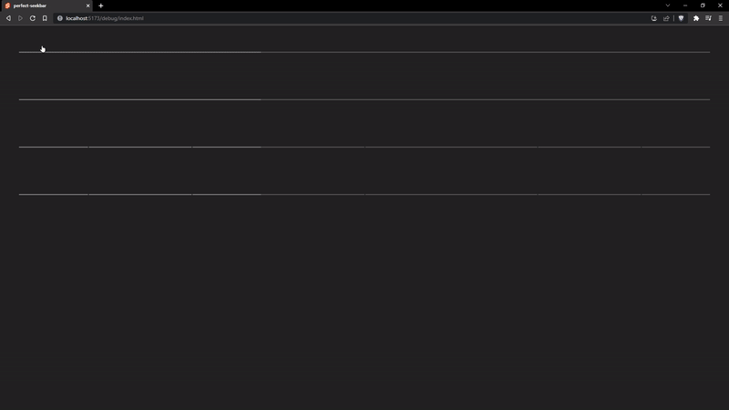

<h1 align="center">
	Perfect Seekbar
</h1>
<p align="center">
  <br>
</p>
The ultimate seek/progress bar. Pixel perfect, smooth and reactive. Supports chapters, thumbnails, buffering and hovering.

## Functions:
```jsx
import Seekbar from 'perfect-seekbar'

let progress = 10
const duration = 450
let seek = 0
const chapters = [
  { size: 20, title: 'Recap' },
  { size: 15, title: 'Opening' },
  { size: 50, title: 'Episode' },
  { size: 15, title: 'Ending' },
]
async function thumbnailGenerator (percent) {
  return thumbnails[Math.floor(percent)]
}

(
<Seekbar 
  accentColor='#f00' 
  bind:progress 
  buffer={15} 
  bind:seek 
  length={duration} 
  {chapters} 
  getThumbnail={thumbnailGenerator}
  on:seeked={handleSeeked}
  on:seeking={handleSeeking} />
)
```
All values are bindable and reactive, and can be updated at any point.
- `accentColor` - CSS color - to use as the accent color for the progress
- `progress` - Number - percent progress in the bar ex: `56.4664`
- `buffer` - Number - percent buffered ex: `56.4664`
- `seek` - Number - percent seeking when the user is hovering or dragging the bar ex: `56.4664`
- `length` - Number - progress duration in seconds, set to falsy if you want to hide the timestamp ex: `153.4265`
- `chapters` - Array\<Object\> - array of chapter objects with a percentage size and optional title ex: `[{ size: 20 }, { size: 80, title: 'Main' }]`
- `getThumbnail` - async function - getter for a thumbnail for a given percentage progress
- `on:seeking` - event emitted when the user is dragging the bar, you can just bind the progress variable if you use svelte
- `on:seeked` - event emitted when the user finishes dragging the bar

Or use as a web component outside Svelte:
```html
<script src="https://cdn.jsdelivr.net/npm/perfect-seekbar@latest/dist/perfect-seekbar.js"></script>
<body>
  <perfect-seekbar></perfect-seekbar>
</body>
<script>
  const seekbar = document.querySelector('perfect-seekbar')
  video.addEventListener('timeupdate', () => { seekbar.progress = video.currentTime / video.duration })
  seekbar.addEventListener('seeking' ({ detail }) => { video.currentTime = detail * video.duration })
</script>
```